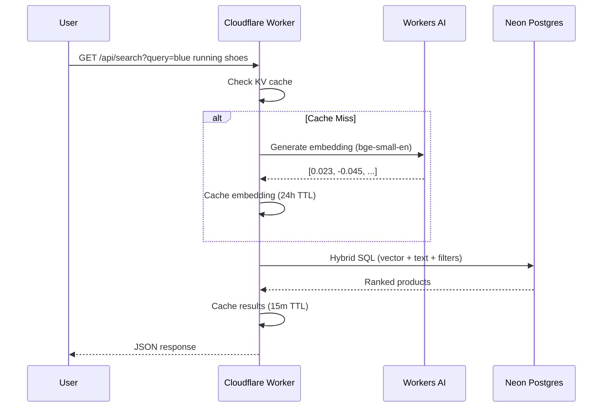

# MEGG API - System Architecture

> **Version**: 2.1.0 (Hybrid Edge/Serverless + Semantic Search)
> **Status**: Production Ready
> **Pattern**: Global Edge Gateway with Serverless Origin + pgvector AI Search

## 1. Executive Summary

The MEGG API utilizes a high-performance **Hybrid Edge Architecture** designed for maximizing cache hit rates, minimizing latency, and reducing infrastructure costs. It leverages **Cloudflare Workers** as a global intelligent gateway that handles 90% of read traffic, with **Vercel Serverless Functions** providing the computational power for complex write/search operations. Data persistence is managed by **Neon (Serverless Postgres)** and **Cloudflare R2** (Object Storage).

**New in v2.1**: Semantic Search powered by **pgvector** + **Cloudflare Workers AI** for intelligent product discovery.

---

## 2. System Context

```mermaid
graph TD
    User[Mobile/Web Client] -->|HTTPS/443| CF[Cloudflare Network]
    
    subgraph "Edge Layer (Cloudflare)"
        CF -->|Route: /api/*| Worker[Edge Worker (Hono)]
        Worker -->|Check Cache| KV[Cloudflare KV]
        Worker -->|Generate Embedding| AI[Workers AI (bge-small-en)]
    end
    
    subgraph "Data Layer (Neon)"
        Worker -->|Auth/Read| Neon[Neon Postgres (Serverless)]
        Neon -->|pgvector| Vector[Vector Similarity Search]
        Neon -->|tsvector| FTS[Full-Text Search]
    end
    
    subgraph "Compute Origin (Vercel)"
        Worker -->|Proxy: Search/Write| Vercel[Vercel Serverless API]
        Vercel -->|Write| Neon
        Vercel -->|Process & Upload| R2[Cloudflare R2]
    end
```

---

## 3. Component Architecture

### 3.1 Edge Gateway (Cloudflare Workers)
**Role**: The primary entry point. Handles routing, authentication, caching, and embedding generation.
- **Tech Stack**: Hono (Lightweight Web Framework), JavaScript.
- **Responsibilities**:
    - **Authentication**: Verifies Neon Auth session tokens directly against DB/Cache.
    - **Embedding Generation**: Uses Workers AI (`@cf/baai/bge-small-en-v1.5`) to generate query embeddings for semantic search.
    - **Caching Policy**: Implemented using Cloudflare KV.
        - `TTL: 15m` (Default)
        - `TTL: 5m` (Trending)
        - `TTL: 24h` (Query Embeddings)
    - **Direct DB Access**: Uses `@neondatabase/serverless` for low-latency queries over HTTP.
    - **Proxying**: Routes complex requests to Vercel origin.

### 3.2 Compute Origin (Vercel)
**Role**: Handling CPU-intensive tasks and write operations.
- **Tech Stack**: Express.js, Node.js.
- **Responsibilities**:
    - **Hybrid Search Engine**: Combines pgvector similarity, full-text search, and popularity ranking.
    - **Auto-Generation**: Automatically generates `semantic_tags` and `embedding` on product creation/update.
    - **Image Processing**: Resizing and format conversion (Sharp) before uploading to R2.
    - **Transactional Writes**: Complex update flows (e.g., creating outfits with multiple products).

### 3.3 Data Layer (Neon Postgres)
**Role**: Single source of truth with AI-powered search.
- **Tech Stack**: PostgreSQL 17 (Serverless) + pgvector extension.
- **Schema**: Relational model with vector and JSONB extensions.
- **Search Columns**:
    - `search_vector`: tsvector for full-text search (auto-generated by trigger)
    - `semantic_tags`: text[] for tag-based filtering
    - `embedding`: vector(384) for AI semantic similarity
- **Optimization**:
    - `GIN` indexes for JSONB and search vectors.
    - `B-tree` indexes on filter columns (category, color, brand).
    - Exact vector search (no IVFFlat - faster for <2K products).

### 3.4 Storage Layer (Cloudflare R2)
**Role**: Immutable blob storage for media.
- **Interface**: S3-compatible API.
- **Optimization**:
    - Zero egress fees.
    - **Image Variants**: Stores `thumb`, `medium`, `large` WebP versions.
    - **CDN Integration**: Served directly via Cloudflare CDN.

---

## 4. Semantic Search Architecture

### 4.1 Hybrid Search Algorithm
The search combines three signals with weighted scoring:

```
Combined Score = (0.5 × Vector Similarity) + (0.3 × Text Match) + (0.2 × Popularity)
```

| Signal | Source | Weight |
|--------|--------|--------|
| Vector Similarity | pgvector cosine distance | 50% |
| Text Match | tsvector + semantic_tags | 30% |
| Popularity | Product clicks/views | 20% |

### 4.2 Search Flow



### 4.3 Auto-Generation on Product Create/Update

When a product is created or updated, the system automatically generates:

| Field | Method | Timing |
|-------|--------|--------|
| `search_vector` | PostgreSQL trigger | Immediate (sync) |
| `semantic_tags` | Based on category, color, brand, price | Immediate (sync) |
| `embedding` | Cloudflare Workers AI API | Async (fire-and-forget) |

**Environment Variables Required**:
```env
CF_ACCOUNT_ID=your_cloudflare_account_id
CF_API_TOKEN=your_cloudflare_api_token
```

---

## 5. Key Design Decisions

### 5.1 "Split Brain" Routing
By separating Reads (Workers) from Writes (Vercel), we achieve:
1. **Cost Efficiency**: 90% of traffic (reads) hits the cheaper/free Workers platform.
2. **Performance**: Reads happen at the edge (close to user).
3. **Complexity Isolation**: Complex transactional logic stays in the mature Express environment.

### 5.2 Exact Vector Search (No ANN Index)
For product catalogs under 2,000 items, exact vector search is faster than ANN indexes:
- No index maintenance overhead
- 100% recall (perfect accuracy)
- Lower memory footprint

### 5.3 Edge Embedding Generation
Generating query embeddings at the edge (Cloudflare Workers) provides:
- Sub-50ms embedding generation globally
- 24-hour caching of query embeddings
- Free tier eligible (10K requests/day)

---

## 6. Security & Scalability

- **Input Validation**: Edge Worker validates UUIDs and param limits before logic execution.
- **Database Connection**: Uses Connection Pooling/HTTP-proxy in Neon driver.
- **DDoS Protection**: Inherited from Cloudflare (WAF).
- **Rate Limiting**: Implemented for Auth/Write endpoints.
- **Minimum Query Length**: 3 characters required for embedding generation.

---

## 7. Migration Status

| Component | Status | Notes |
|-----------|--------|-------|
| **Database** | ✅ Complete | Neon PostgreSQL 17 |
| **Auth** | ✅ Complete | Neon Auth |
| **Media** | ✅ Complete | Cloudflare R2 |
| **API** | ✅ Complete | Cloudflare Worker + Vercel |
| **Semantic Search** | ✅ Complete | pgvector + Workers AI |
| **Auto-Generation** | ✅ Complete | Built into product service |
